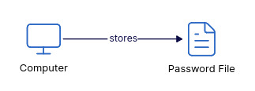
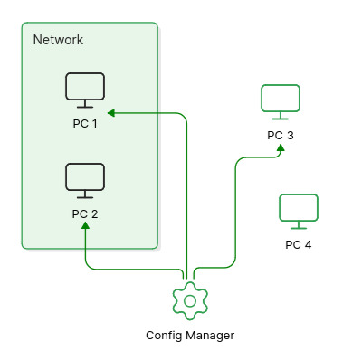
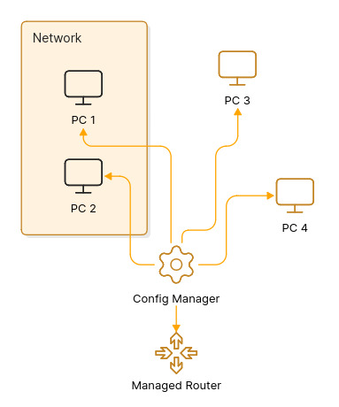

This blog is a summary of what was taught at HTB Meetup Mumbai #16 held on 30th May 2026.

<!-- truncate -->

So let's dive into it (hey, wait a minute, why do I feel like I am starting to sound like chat gipidy day by day, anyways, let's start)

## Session 1: "Authentication for Dummies" by Adhokshaj Mishra

### What is authentication?
- <mark>Process of verifying the identity of user, device or service before granting access to resources.</mark>
- ***Authentication*** = *"Who you are?"*, whereas ***Authorization*** = *"What you can do?"*

### How authentication used to take place in earlier days of computing?
- In the 1960s, systems were large, expensive mainframes or there were time sharing machines.
- Fernando Corbató (often called "Corby") at MIT introduced passwords as part of the Compatible Time-Sharing System (CTSS) around 1961.

><mark>CTSS was one of the first time-sharing operating systems, allowing multiple users to share a single mainframe (IBM 7090/7094) with private files.</mark>

<figure>

<figcaption class="diagram-caption"><strong>Fig:</strong> Early authentication was tied to single, shared mainframe access before central identity systems existed.</figcaption>
</figure>

- Passwords were initially stored in plaintext (a simple file in the filesystem), which was rudimentary by design.
- Robert Morris later introduced one-way hashing in 1974 to improve storage security.

### How authentication will work if we scale the above plan to multiple computers?
- The above plan would be a nightmare for multiple computers as 
    1. We have to manually copy paste credentials everywhere, so changes/updates on one system will require updates on every system, 
    2. Policies will be inconsistent, it would be hard to audit/trace that whether provision of credentials took place on all systems or not.
- To solve this lets add configuration management. 

>What is **configuration management**? 
><mark>In context of authentication and user provisioning, configuration management means managing the settings and rules that control how users are created, updated, assigned permissions, and removed across systems.</mark>

- So configuration management will centralize user provisioning. 
- But what if some of our nodes are not in network, how would you re-provision them, this is the problem with *push model*, if there are network outages, partial failures, or offline nodes it leads to inconsistency in network.
- At that time bandwidth was also costly, we had links operating at Kbps, we cannot just make frequent pushes, as it consume the entire bandwidth and hence would be very costly.

<figure>

<figcaption class="diagram-caption"><strong>Fig:</strong> Central configuration management reduced repeated credential pushes and kept authentication policies consistent.</figcaption>
</figure>

- Lets do a small trick to save bandwidth, we will use the inverted *pull model*, 
- What is it? In place of central config manager periodically user provisioning, we will make the nodes periodically poll a central config manager. 
- What will be the policy to do this? (as we again have to save bandwidth, we can't just poll the manager as it would choke up our links) Check if creds are stored locally, if not, poll the manager.
- Then how would updates in creds (like change in password) be managed? Do polling at night from all nodes at night or during offline hours, will help in keeping the channel clear during working hours, while also updating creds on all the nodes.

### Authentication on Managed Routers
Years later, technological advancements led to introduction of more devices into the network.
Lets take and example, we introduce a managed router into the network.

> <mark>Managed switches/routers: Configurable via CLI, SNMP, web interfaces, or central tools. Unlike "dumb" unmanaged devices (plug-and-play), managed ones allow VLANs, QoS, monitoring, port security, and firmware updates.</mark>
> We can provision these like nodes using config manager

<figure>

<figcaption class="diagram-caption"><strong>Fig:</strong> Managed routers need authentication designs that avoid local credential caching.</figcaption>
</figure>

- Now how would you authenticate into these devices? How would you provision them? 
- We can't store creds on router as security concerns grew with figures like **Kevin Mitnick** started to enter the scene. Attackers could compromise routers (firmware implants, backdoors), we don't know whether attacker is sitting into the router or not, resetting router doesn't help as he might have compromised firmware or hardware.
- Computers are modifiable, but routers are closed cause we cannot change internal components and software (its blackbox - you have to go to service center to make changes).
- Resetting might not help if firmware is tainted. 
- So what is the solution? Avoid caching creds on devices; query a central authority on every login.

### Introduction of ISP into the scene
Years later, ISP entered the scene. What does it offer to the organisation? 
- ISP says connect to us we will connect you to the world, now how do you authenticate with ISP? Because ISP needs to do billing and give internet to the authorized users only.
- Also previously the entire n/w was ours, now we have two parts - 
    1. ISP 
    2. and Public n/w, 
- The catch is we do not trust public n/w, but we trust ISP. 
- And we are assured about security of our n/w. 
- But we don't know what kind of trash is coming up at us from public n/w to ISP and ultimately would land up in our internal n/w and we definitely don't want that.

So how do we solve this problem? Let's see...

<figure>

<figcaption class="diagram-caption"><strong>Fig:</strong> The RAS edge separates the public network from the trusted ISP/internal network in the authentication flow.</figcaption>
</figure>

### The making of RADIUS
#### Remote Access Service (RAS) and the edge
Add a <mark>Remote Access Service (RAS) at the edge as the single point of connection between the public network and the ISP's internal network.</mark> The RAS (also called a ***Network Access Server (NAS)***) accepts connection attempts from the untrusted public side and forwards authentication/authorization requests to an ***Authentication Service (AS)*** that lives on the ISP/internal side.

- Why this separation? The RAS is on the untrusted edge; the AS is inside the trusted ISP/domain. Clients reachable from the public internet can talk to RAS, but they should never be trusted to store long-term secrets (no credential caching on the edge when the path may be compromised).

- So what is the catch here? any consequence? Yes, every login may require the RAS to query the AS, increasing traffic between RAS and AS. To limit bandwidth/complexity, protocols were designed to be simple and lightweight.

That's where our hero comes in!!

#### RADIUS 
<mark>**RADIUS** (Remote Authentication Dial-In User Service) was created for that model: a lightweight, client/server AAA protocol where the NAS (RAS) forwards credentials to a RADIUS server (the AS) and receives simple codes back:</mark>

- *Access-Request* — authentication request from NAS to server
- *Access-Accept* — success
- *Access-Reject* — failure
- *Access-Challenge* — challenge/response flow
- *Accounting (Interim-Update, Start, Stop)* — usage records
- *Change-of-Authorization (CoA)* — dynamic policy changes

RADIUS uses a shared symmetric secret between NAS and server (no expensive public-key handshake at every transaction), and simple packet types to keep bandwidth and processing small. That design trades end-to-end cryptographic guarantees for simplicity and lower per-request cost.

#### Authentication protocol types (brief)
- ***PAP*** (Password Authentication Protocol): <mark>very simple; credentials are sent in the clear by PPP/PAP (RADIUS hides them using the shared secret/MD5 obfuscation).</mark> Easy to implement but weak; servers may store password-equivalent data for verification.
- ***CHAP*** (Challenge-Handshake Authentication Protocol): <mark>challenge/response using one-way hashes (no plaintext sent).</mark> Useful to avoid replay but requires reversible secret material at the verifier in some deployments.
- ***MS-CHAP / MS-CHAPv2***: Microsoft variants with incremental improvements (and notable historical weaknesses).
- ***EAP*** (Extensible Authentication Protocol): <mark>framework that allows many methods (TLS, OTP, token cards) and is commonly proxied over RADIUS for Wi‑Fi/802.1X and VPNs.</mark>

>**Note:** *RADIUS and credential handling*
> <mark>Some authentication methods require the server to know the user's actual password (or something equivalent to it) in order to verify the login.</mark> 
> - ***Why this happens:*** some NAS-side auth methods (PAP, certain CHAP deployments) require the verifier to compute or compare values derived from a user's secret. That often forces a RADIUS server to hold plaintext or password-equivalent material so it can validate requests.
> - ***Risk:*** storing password-equivalent data on RADIUS (or on any front-line AAA box) increases blast radius — a compromised RADIUS/proxy exposes many user secrets and enables lateral abuse.
> - ***Practical limitation:*** hashed+salted passwords (one-way hashes) are safest for storage, but they make some challenge/response schemes (that need the raw secret) impossible without an intermediary that can perform verification.

#### Accounting and Interim-Update (tracking usage)
<mark>**RADIUS Accounting** (RFC 2866) supports session records:</mark>
- *Start, Interim-Update, Stop.* 
- <mark>***Interim-Update*** messages are periodic reports (common interval: every 5 minutes) that carry bytes/packets/time counters.</mark> 
- These let the provider track quota consumption (e.g., a 30 GB monthly pack), perform throttling when limits are hit, or terminate sessions when allowance is exhausted. 
- Timestamps are Unix-time based and are commonly used in billing/analytics.

What happens? an example flow - 
- NAS sends Start when user connects, Interim-Update periodically, and Stop when session ends. 
- The accounting server aggregates and enforces policies (throttle, suspend, terminate).

### What would you do when the internal network cannot be fully trusted?
If you cannot or do not want to trust the internal network or want to avoid hammering the AS with repeated full authentications, introduce a ***ticketing model*** (PS: Our soft inro to the three headed god: The **Kerberos**):

- <mark>The ***Authentication Service (AS)*** issues a time-bound cryptographic ticket (***TGT***) after initial authentication.</mark>
- <mark>The client uses the ticket to request service tickets from a ***Ticket-Granting Service (TGS)*** for specific services, avoiding repeated full auths to the AS.</mark>
- <mark>Tickets contain timestamps/nonces and are encrypted so replay attacks are mitigated; digital signatures or authenticators further protect freshness.</mark>

This offloads repeated authentication from the AS/KDC and enables ***single sign-on (SSO)***. <mark>**Kerberos** is primarily symmetric-key based (with public-key extensions) and relies on a **KDC** (AS + TGS) and synchronized time for replay protection.</mark>

#### Directory services and Domain Controllers
Many deployments pair **Kerberos** with a directory (***LDAP*** / ***Active Directory***). <mark>**LDAP** stores user principals, service principals, and attributes (groups, policies).</mark> In Windows ecosystems the ***Domain Controller (DC)*** <mark>bundles KDC functionality, LDAP directory, DNS, and other services required for centralized identity and service discovery.</mark>

## Session 2: "From SSRF to RCE: Discovering CVE in Digital Ocean Droplet Agent" by Anmol Singh Rajput

### DigitalOcean Droplets and the Droplet Agent
- DigitalOcean Droplets are Linux-based virtual machines (VMs) provided by DigitalOcean.
- The ***Droplet Agent*** is a system service installed on every Droplet that handles tasks like SSH key management and configuration monitoring.
- Because it manages critical system configuration, it runs with ***high privileges (root)***.

> <mark>Metadata Services (169.254.169.254): Cloud providers use a local, non-routable IP address to allow VMs to query information about themselves (metadata).</mark> This address is only accessible from inside the VM or the internal network.

> <mark>Server-Side Request Forgery (SSRF):</mark> an attacker forces a server to make network requests on their behalf. In cloud environments, SSRF is often used to trick the web server into querying the provider's metadata service.

> <mark>Command Injection & RCE:</mark> command injection occurs when unsafe, user-supplied data is passed to a system shell. Remote Code Execution (RCE) is the ultimate goal: arbitrary commands running on the target machine remotely.

### Comprehensive Summary: CVE-2026-24516
- **CVE:** CVE-2026-24516
- **Vulnerability Type:** Command Injection
- **Target:** DigitalOcean Droplet Agent
- **Impact:** Unauthenticated Remote Code Execution (RCE) as Root
- **Researcher:** Anmol Singh Rajput (poxsky)
- **Reported:** January 2026

### The Droplet Agent and the Danger
- The DigitalOcean Droplet Agent (codename "DOTTY") runs as a system service with ***root privileges*** on every Droplet.
- Its core functions include SSH key management, monitoring SSH configurations, and executing troubleshooting commands via a metadata API.
- The danger comes from the agent trusting the link-local metadata address at <mark>169[.]254[.]169[.]254</mark> without authentication.
- The source code is publicly accessible on GitHub, which made the attack surface easier to analyze.

### The Vulnerable Attack Chain
The researcher found a 5-step exploit chain that leads to complete system compromise:

1. **Port Knocking**: The agent listens for a specific, undocumented TCP SYN packet on port 22. The packet must contain hardcoded sequence and acknowledgment numbers corresponding to the ASCII values for "DODO" and "TTY".
2. **Metadata Fetch**: Once the port knock is detected, the agent requests troubleshooting metadata from <mark>http[:]//169[.]254[.]169[.]254/metadata/v1[.]json</mark>.
3. **Flawed Validation**: The system validates the command string using `HasPrefix(artifact, "command:")` instead of enforcing an exact match.
4. **Direct Execution**: Because only the prefix is checked, an attacker can append malicious payloads like `command:bash -c 'rm -rf /'`, which are passed directly to `cmd.Run()` and `exec.CommandContext()` without sanitization.
5. **Root RCE**: The arbitrary commands execute with the agent's root privileges.

### Realistic Attack Scenarios
- **Scenario A (SSRF Chain Attack):** An attacker exploits an existing SSRF bug in a customer's web app to reach the internal metadata IP. They serve a malicious JSON response containing crafted commands and send the magic TCP SYN packet to trigger execution. This requires ***zero credentials*** and ***zero user interaction***.
- **Scenario B (Network Compromise):** An attacker on the same network segment intercepts metadata traffic (for example via ARP poisoning) and sets up a fake metadata server on 169[.]254[.]169[.]254. They then trigger the vulnerability using the port knocking sequence.

### Global Impact
- **Scale:** Over 100,000 Droplets were potentially at risk.
- **Speed:** Exploitation takes less than one hour.
- **Consequences:** Attackers could exfiltrate sensitive data (SSH keys, database passwords, `/etc/shadow` dumps, application secrets), establish persistence (SSH backdoors, rootkits, cron jobs), or deploy wide-scale ransomware or supply chain attacks.

### The Researcher's Journey & Key Takeaways
- **Timeline:** Report submitted on Jan 20, initially closed as "Out of Scope" due to a perceived lack of realistic exploitation scenario. It was escalated on Jan 23 with detailed MITM and SSRF attack paths, then MITRE assigned the CVE and the vendor confirmed the vulnerability.
- **Suggested Fixes:** exact command allowlists, input sanitization, metadata authentication with HMAC signatures, and rate limiting for port knocking.

> **Lessons Learned for Hunters:**
> - Read public source code to find open attack surfaces.
> - Combine minor issues into critical vulnerabilities through chaining.
> - Never assume link-local addresses are safe.
> - If you believe in your finding after a rejection, escalate with solid evidence.

## References and further reading
- RFC 2865 — Remote Authentication Dial In User Service (RADIUS): https://www.rfc-editor.org/rfc/rfc2865.txt
- RFC 2866 — RADIUS Accounting: https://www.rfc-editor.org/rfc/rfc2866.txt
- RFC 4120 — The Kerberos Network Authentication Service (V5): https://www.rfc-editor.org/rfc/rfc4120.txt
- RFC 3748 — Extensible Authentication Protocol (EAP): https://www.rfc-editor.org/rfc/rfc3748.txt
- RFC 1334 / RFC 1994 — PPP PAP and CHAP (historical PPP auth): https://www.rfc-editor.org/rfc/rfc1334.txt and https://www.rfc-editor.org/rfc/rfc1994.txt
- RADIUS overview (background/history): https://en.wikipedia.org/wiki/RADIUS
- Kerberos overview (history and tickets): https://en.wikipedia.org/wiki/Kerberos_(protocol)
- History of Authentication: https://cybersecurity.asee.io/blog/history-of-authentication/
- The History of the Computer Password: https://www.wired.com/2012/01/computer-password/
- Password History and Evolution: https://fusionauth.io/blog/password-history
- DigitalOcean metadata service overview: https://docs.digitalocean.com/products/droplets/how-to/use-metadata/
- OWASP SSRF overview: https://owasp.org/www-community/attacks/Server_Side_Request_Forgery
- MITRE CVE-2026-24516: https://cve.mitre.org/cgi-bin/cvename.cgi?name=CVE-2026-24516

