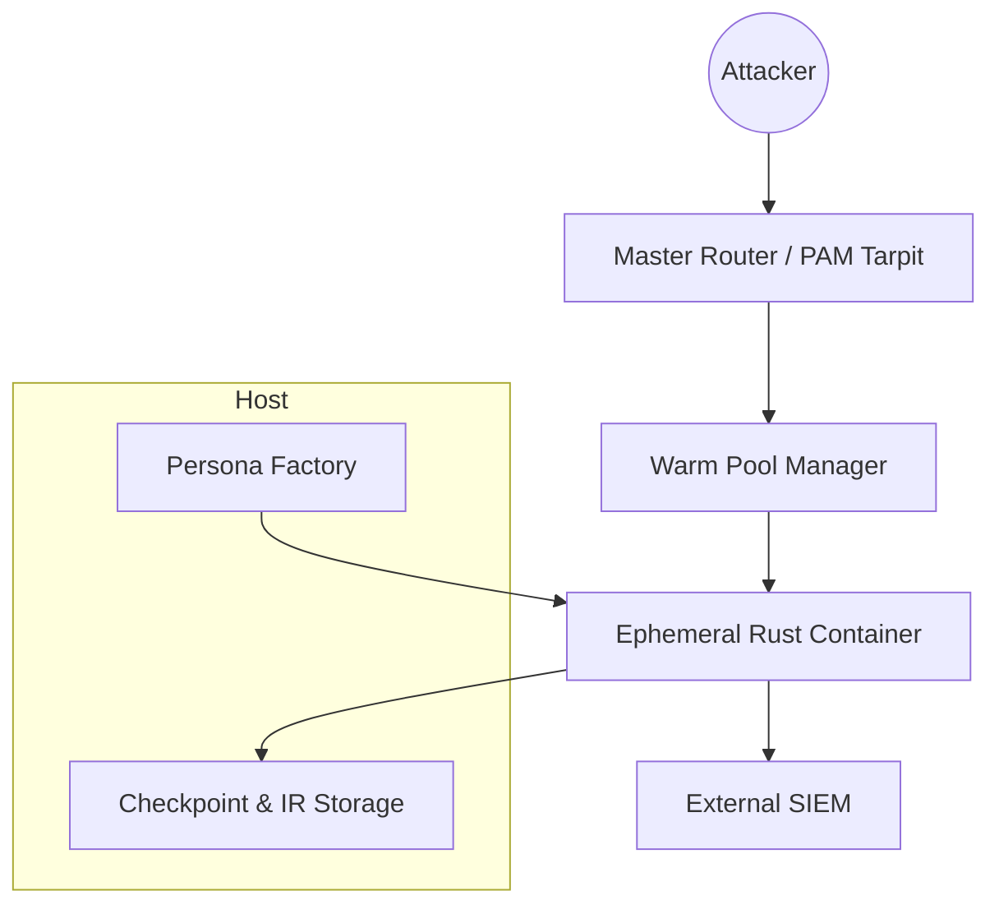
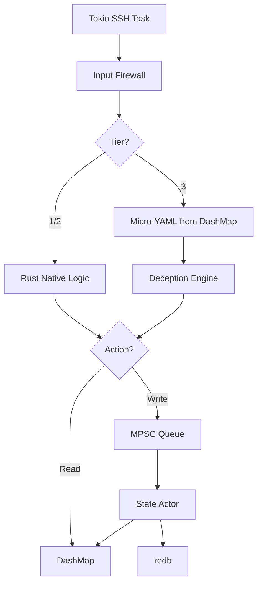
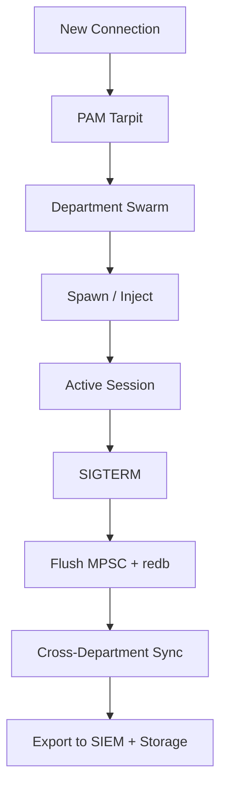

Modern honeypots are hollow, easily fingerprinted and abandoned by attackers within minutes. Māyājāl is a self-scaling, agentic, multi-LLM honeypot framework built on a memory-safe Rust core that generates entire corporate deception environments on demand and converts every attacker keystroke into production-ready detections in real time.


<style>
.diagram-container {
  display: flex;
  justify-content: center;
  margin: 2rem 0;
}

.diagram-container figure {
  text-align: center;
}

.diagram-img {
  max-width: 100%;
  height: auto;
}
</style>

<!-- truncate -->
## Intro and some banter

If you opened this blog, I guess that either you are regular reader of blogs that I write on this site or you came through a post that I made on LinkedIn. Now today's blog is something different, its on a framework that me and couple of my friends worked on but were never able to complete due to some pedestals in our route, and we never tried to overcome them, so I would start with some banter regarding what happened and why finally I decided to publish this paper as a blog.

Yup! Last year, Me and my friend were trying to work on this framework, but we weren't able to publish this paper and here I am, I would like to publish this as a blog if people don't value the effort... Am I sounding frustrated? Because slightly I am, we tried to present the paper at a very novel conference in our country but were rejected with the comment as "The paper is completely AI Written, its language is not understandable. There is no clarity work." and many more comments, like did they even read the framework or I am just in a delusion that what we made is good and in reality it isn't (because every creator loves his own creation, might be the case that I am blind - referring to the same phenomena)? Just ping me on LinkedIn if you find it interesting, I wanted to work on it, but rejected the idea of bringing it to life, why? because I tried to make it as a semester project and the external that came to review it, by looking at the prototype told us that it was trash and he would fail us if we continued this and said we just wasted our time.

At the end, I thought that he(the external faculty that came to review) might not be wrong, we did not do something novel, we just arranged some bits and pieces that were created by some other great people and put them together to create a new framework and gave it a name and were calling it novel, now what brings me here then, if I already had that thought in my mind, I am still unsure that people require this framework or not. So presenting you this novel or cliché or novel or cliché or novel or cliché.... I still don't know, So presenting you this framework...... DRUMS!!

> **Note:** Māyājāl is currently presented as a framework and architectural design. A reference implementation is NOT under active development. This blog post is based on a research paper I co-authored with a colleague. The high-level ideas, core architectural decisions, and the overall system design are mine. The implementation details of the Persona Factory workflow were contributed by my colleague, why? because he is great at AI, and I am not, he designed something good, you will later see in this blog.

---

## The Problem

There is no problem as such with exsisting solutions, as I already told you we were planning to write a paper on it so I will keep the section headers as it is, why? because I want to make the fun of FORMAT specified by people who do not know anything about our field and the whole purpose of this framework was to increase attacker dwell time and make the honeypot seem as realistic as possible. And as the FORMAT says that you have to identify some gaps in exisisting solutions so here we go, there are no gaps in them, they all are great on their own, infact we are inspired from them and this framework is trying to improve existing systems(by putting everything together).

---

## The Trilemma That Has Haunted Honeypot Design

The [HoneyGPT](https://arxiv.org/abs/2406.01882) paper formalized a structural conflict that has plagued terminal honeypot design:

> **The Flexibility–Interaction–Deception Trilemma:** No existing terminal honeypot can simultaneously deliver all three of these properties.

| Property | What It Means |
|---|---|
| **Flexibility** | Ability to instantiate hundreds of distinct personas and configurations without manual effort |
| **Interaction Depth** | Survival under interactive tools and long-running sessions |
| **Deception Quality** | Presence of believable user artifacts (browser history, SSH keys, corporate documents) and consistent system state |

No pre-LLM system could achieve more than two simultaneously.
---

## How Previous LLM Honeypots Tried (and Failed)

### First Generation: Commercial LLMs (2023–2024)

Projects like [HoneyGPT](https://arxiv.org/abs/2406.01882), LLMHoney, and [SSHoney](https://arxiv.org/abs/2409.08234) demonstrated that a commercial LLM (GPT-4, Claude 3, Gemini 1.5) could generate plausible terminal responses. Median dwell time increased drastically (I assume, because I don't remember what they stated in the paper, its being a while I have read them).

But they suffered from fatal limitations:

- **Hallucinated filesystem and process state** — No real directories or persistent files. The LLM made up directory listings that contradicted themselves across commands.
- **Single-instance Python architecture** — Vulnerable to memory leaks, crashes under interactive tools, and container escape.
- **Zero horizontal scaling** — Each new IP or persona required a separate process and hand-crafted prompt.

### Second Generation: Local LLMs (2024–2025)

Projects like [Beelzebub](https://github.com/mariocandela/beelzebub) (SSH honeypot) and [Galah](https://github.com/0x4D31/galah) (HTTP web honeypot) replaced commercial APIs with locally hosted models (Llama 3, Mixtral, Command-R) via Ollama or vLLM. This eliminated API costs and reduced data exfiltration risk.

But because none of these models were fine-tuned on authentic terminal interaction data, they routinely produced:

- Wrong error messages and impossible file permissions
- Inconsistent command outputs
- Obvious linguistic and behavioral artifacts

Interaction depth *regressed*, attackers disengaged rapidly, and **scalability remained entirely manual**.

---

## Introducing Māyājāl

**Māyājāl** (from Sanskrit, meaning *web of illusion*) is a terminal honeypot framework that simultaneously addresses all three corners of the trilemma. It is built as a **self-scaling, agentic, multi-LLM ecosystem** on top of a **memory-safe Rust attack surface**.

Here's how each corner is solved:

| Trilemma Corner | Māyājāl's Solution |
|---|---|
| **High-Fidelity Realism** | A fine-tuned code model (via QLoRA + CorDA continued pre-training) on real and synthetic Ubuntu terminal sessions — survives `vim`, `tmux`, `gdb`, `strace`, and complex priv-esc chains |
| **Sustained Engagement** | An agentic LLM (Persona Factory) autonomously synthesizes entire corporate workforces — hundreds of employees with complete digital lives |
| **Operational Scalability** | The same agent deploys Dockerized honeypot containers on demand, binding them to new IPs with zero human intervention |

And critically, a **second agent** (the TTP Analyst) continuously transforms raw honeypot sessions into structured MITRE ATT&CK timelines, YARA rules, Sigma rules, and incident reports — closing the loop from keystroke to detection in seconds.

---

## The Architecture: How the Illusion is Built

To pull off a realistic corporate network illusion without draining our wallets on API costs or making the attacker wait 10 seconds for a response, we designed a hybrid architecture. It combines a fast, memory-safe **Rust orchestrator** on the host, a warm pool of **ephemeral containers**, and a **Persona Factory** powered by LLMs to pre-generate the assets.

Here is the high-level breakdown of the host and container layers:

| Layer | Component | Key Responsibility |
|---|---|---|
| **Host Layer** | Master Router & PAM Tarpit | Connection handling, routing, and adding artificial jitter. |
| | Warm Pool Manager | Pre-spawning blank containers so we have zero cold-start delay. |
| | Persona Factory | Map-reduce agentic pipeline that generates employee profiles. |
| | Checkpoint & IR Storage | Storing session snapshots and quarantining real malware payloads. |
| **Ephemeral Container Layer** | Rust Core (`Tokio` + `russh`) | Fast, lightweight SSH shell handling. |
| | State Engine (`DashMap` + `MPSC` + `redb`) | Deadlock-free memory and persistent database. |
| | Tiered Command Processor | Decides whether to run native Rust commands or ask the LLM. |
| | Payload Trap | Intercepts, downloads, and quarantines malicious scripts. |

---

## 1. The Persona Factory: Manufacturing Digital Human Lives

My colleague designed this part (remember, the AI genius?). The goal here was to create a realistic corporate environment on demand. If an attacker lands on a container, they shouldn't just see a clean Ubuntu install. They should see git histories, config files, bash history, personal notes, SSH keys, and half-written scripts that match the user's role. 

Doing this at runtime with an LLM is way too slow, so we do it ahead of time using a **Map-Reduce agentic pipeline**:

1. **Pre-Flight Engine**: Takes compulsory inputs (like number of departments and users per department, defaulting to 10) and optional inputs (specific usernames, passwords, hostnames). If nothing is specified, it pulls leaked usernames and passwords from the **RockYou** wordlist. It then generates a unified `corporate_directory.toml`.
2. **Architect Agent**: Looks at the TOML and plans required custom files for each user based on their role (e.g., an engineer gets SSH config files and Dockerfiles; an HR user gets resumes and PDFs).
3. **Parallel Micro-Generators**: Spin up LLM calls in parallel to generate the contents of each planned file.
4. **Validator Agent**: A separate agent checks the generated files for syntax errors and realism, retrying if the LLM hallucinated something unusable.
5. **Assembler**: Merges all these files with a `base_linux_fs.yml` template to output a comprehensive `[username].yml` filesystem blueprint.

The resulting disk structure looks like this:
```text
FS/
├── base_linux_fs.yml
├── Engineering/
│   ├── johndoe.yml
│   └── ... (custom files, ssh keys, workspace configs)
├── HR/
│   ├── johndoe.yml (cloned/adapted for shared network accounts)
```

---

## 2. Orchestration: Warm Pools & Department Swarming

If we spawned containers on the fly when an attacker connects, they’d notice the lag (cold start). And timing attacks are a honeypot’s worst enemy. 

To solve this, we built:
- **PAM Tarpit with Jitter**: When a connection attempt is made, the Master Router holds the connection with a random jitter of 1–3 seconds. This mimics real network latency and buys us time.
- **Warm Pool Manager**: We maintain a buffer of **15 to 20+ blank container instances** at all times. When the attacker connects, we grab a container from the pool, inject the pre-generated YAML or database snapshot corresponding to the targeted user, and hand over the session instantly.
- **Department Swarming**: Here’s the fun part. If an attacker compromises a user in the "Engineering" department, we don't just stand up that one container. The orchestrator immediately spawns a full subnet containing *all* other users in the Engineering department. 
- **Honeytoken Pivoting**: If the attacker notices other hosts in their `/etc/hosts` or ssh configs and tries to ping or SSH into them, we intercept the outbound connection and route it to the newly spawned containers in the swarm. To the attacker, it looks like they are successfully moving laterally across a real network!

---

## 3. Ephemeral Rust Container Core & Lock-Free State Engine

Inside the container, we run a custom shell written in Rust using `Tokio` and `russh`. 

### The State Engine: No Deadlocks, No BS
Traditional honeypots often suffer from deadlocks or write-amplification when multiple processes write to the simulated disk. We avoided this by splitting reads and writes:
- **Reads (`DashMap`)**: A highly concurrent, lock-free hash map in Rust that handles fast reads for commands like `cat` or `ls` with zero contention.
- **Writes (`MPSC Queue` + State Actor)**: Instead of writing directly to the disk state, commands send write requests through a Multi-Producer Single-Consumer queue. A single, dedicated **State Actor** processes these writes sequentially. This guarantees **zero deadlocks** and keeps the state consistent.
- **`redb`**: A fast, embedded key-value database written in Rust. The State Actor commits changes directly to an internal `redb` database inside the container. We can also option a shared host `redb` for users shared across multiple departments.

```
       Reads                     Writes
[SSH Client] ---> DashMap <--- [State Actor]
                    ^                |
                    |                v
                    +------------ redb (Internal DB)
```

### Tiered Command Processing
Sending every command to an LLM is a bad idea—it’s slow, expensive, and easy to break. We handle commands in three tiers:
1. **Tier 1 & 2 (Rust Native)**: Basic commands like `cd`, `pwd`, `whoami`, `mkdir`, and simple `ls` are executed instantly by native Rust code.
2. **Payload Trap**: What happens when they try to download a rootkit? If they execute `wget` or `curl`, we let it run! The container performs a real download, saves the malware to an isolated Forensic IR Volume for analysis, and replaces the file in the attacker's virtual directory with a harmless virtual representation.
3. **Tier 3 (Deception Engine / LLM)**: For complex, context-heavy commands (like editing a file, running a custom script, or database commands), we extract a JIT (Just-In-Time) micro-YAML of the current CWD (Current Working Directory). We send this context to the LLM, which generates a structured JSON action containing the terminal output and state changes.

For interactive utilities like `vim` or `nano`, we hijack the PTY and display native Rust UI overlays, allowing the attacker to type freely without feeling any lag.

### Shutdown & Checkpoint Sync
When the session ends or a timeout occurs, the container catches the `SIGTERM` signal:
1. It flushes the remaining MPSC queue writes.
2. The State Actor saves the state to `redb`.
3. It serializes the final state back to a YAML checkpoint.
4. It performs a cross-department sync if the user exists on other containers.
5. It exports raw session logs and quarantined malware to the external SIEM.

---

## 4. Key Mitigations Applied

Here's how we addressed the major security and performance challenges:

- **Deadlocks**: Eliminated by serializing all state writes through the MPSC queue to a single State Actor.
- **Cold Starts**: Eliminated by maintaining a warm pool of blank containers and using a PAM tarpit with jitter to mask injection times.
- **Timing Attacks**: Masked by introducing artificial jitter and random network latency (1-3s).
- **Write Amplification**: Reduced because we only write to the heavy YAML format during checkpoints/shutdown; runtime writes use the lightweight, binary `redb`.
- **Resource Exhaustion**: Managed via aggressive container CPU/Memory limits and automatic session timeouts.
- **Prompt Injection**: A Rust-layer input firewall uses `shlex` parsing, allowlisting, and strict keyword blocking before commands ever reach the LLM.

---

## 5. Architectural & Session Flows

To help visualize how everything fits together, here are the diagrams of the system flows:

### High-Level System Overview


### Container Internal State Engine


### Persona Factory Pipeline
```mermaid
graph LR
    Input[Defender Input + Randomizer] --> TOML[corporate_directory.toml]
    TOML --> Architect[Architect Agent]
    Architect --> Generators[Parallel Micro-Generators]
    Generators --> Validator[Validator + Retry]
    Validator --> Assembler[Merge + Base Linux]
    Assembler --> Disk[FS/[Dept]/[User].yml]
```

### Session Lifecycle & Checkpointing


---

## 6. Remaining Risks & Monitoring

As with any architectural proposal, it's not completely bulletproof. If we were to build the reference implementation today, we'd need to aggressively monitor:
- **Warm Pool Health**: Ensuring containers are refilled faster than an attacker can scan or brute-force connections.
- **Tier-3 Latency**: Monitoring how long the LLM takes to return terminal states and falling back to native mock errors if API latency spikes.
- **Container Terminations**: Alerting on unexpected crashes or attempts at container escapes.
- **Active Red Teaming**: Regular automated testing of the honeypot using tools like Hydra, Metasploit, and custom post-exploitation scripts to see if the illusion holds up.

---

## References

1. A. X. Zhang et al., "[LLM Honeypot: Towards next-gen interactive deception systems](https://arxiv.org/abs/2409.08234)," arXiv:2409.08234, Sep. 2024.
2. L. K. Sharif et al., "[HoneyGPT: Breaking the Trilemma in Terminal Honeypots with Large Language Model](https://arxiv.org/abs/2406.01882)," arXiv:2406.01882, Jun. 2024.
3. A. Amin et al., "LLMHoney: Large-language-model-driven honeypots for interactive deception," 2024.
4. M. Candela, "[Beelzebub: AI-native deception runtime / honeypot framework](https://github.com/mariocandela/beelzebub)," GitHub, 2024.
5. A. Karimi, "[Galah: LLM-powered web honeypot](https://github.com/0x4D31/galah)," GitHub, 2024.
6. T. Dettmers et al., "[QLoRA: Efficient finetuning of quantized LLMs](https://arxiv.org/abs/2305.14314)," NeurIPS, 2023.
7. Y. Yang et al., "[CorDA: Context-Oriented Decomposition Adaptation](https://arxiv.org/abs/2406.05223)," NeurIPS, 2024.
8. DeepSeek-AI, "[DeepSeek-Coder: Enhancing code generation capabilities](https://github.com/deepseek-ai/DeepSeek-Coder)," GitHub, 2024.
9. R. Y. Pang et al., "[ReAct: Synergizing reasoning and acting in LLMs](https://arxiv.org/abs/2210.03629)," arXiv:2210.03629, Oct. 2022.
10. LangChain, "[LangGraph: Directed workflow framework for agentic LLM systems](https://github.com/langchain-ai/langgraph)," GitHub, 2024.
11. MITRE Corporation, "[MITRE ATT&CK](https://attack.mitre.org/)," 2023.
12. SigmaHQ, "[Sigma: Generic signature format for SIEM systems](https://github.com/SigmaHQ/sigma)," 2023.
13. VirusTotal/Cisco Talos, "[YARA: Pattern matching for malware research](https://virustotal.github.io/yara/)," 2016.
